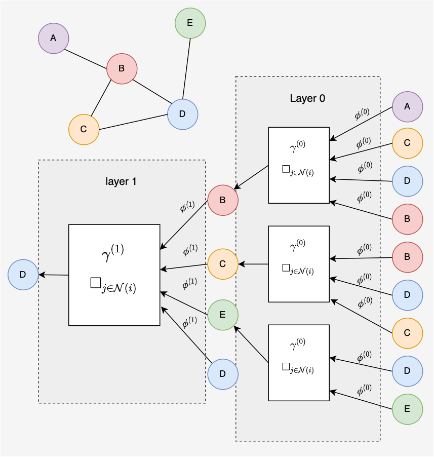
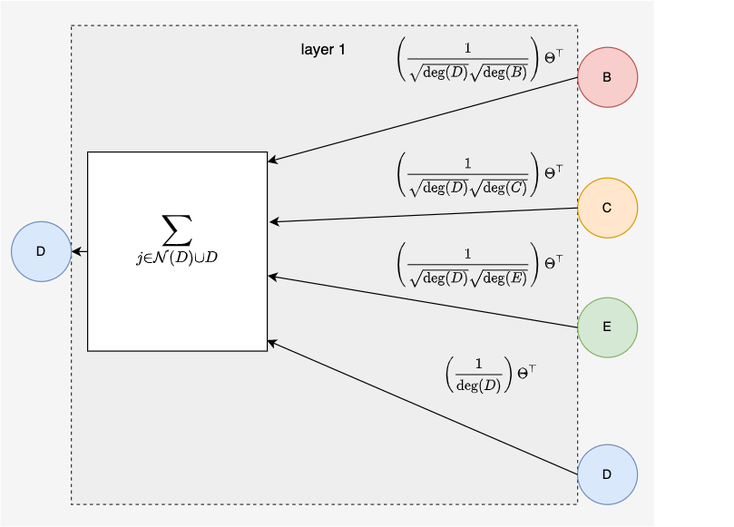
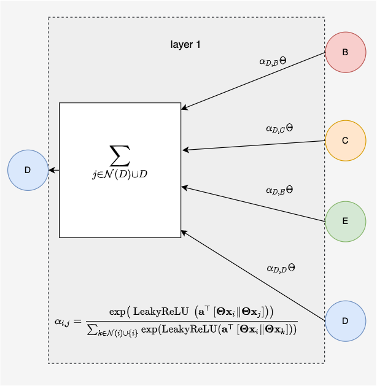
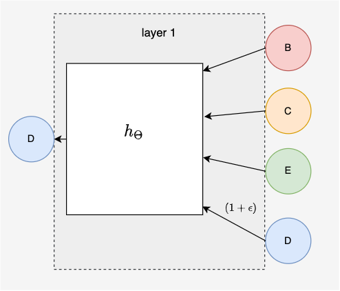

### [Message Passing Framework](https://pytorch-geometric.readthedocs.io/en/latest/notes/create_gnn.html)

**Message Passing View**
> $$
> \mathbf{x}_i^{(k)}=\gamma^{(k)}\left(\mathbf{x}_i^{(k-1)}, \square_{j \in \mathcal{N}(i)} \phi^{(k)}\left(\mathbf{x}_i^{(k-1)}, \mathbf{x}_j^{(k-1)}, \mathbf{e}_{j, i}\right)\right)
> $$
>
> $\square_{j \in \mathcal{N}(i)}$ - Differentiable, permutation invariant function, *e.g.* sum, mean, or max.
>
> $\phi^{(k)}$ - Differentiable functions such as Multi-Layer Perceptrons (MLPs)
>
> $\gamma^{(k)}$ - Differentiable functions such MLPs

### Toy Example

To gain some intuition of a message passing framework we will take a small graph as example.

We will consider messages passed to node $D$ in a 2-layer message passing neural network. The computational graph can be traced out from node $D$ first to a 1-hop neighborhood and then to a 2-hop neighborhood. The 1-hop neighborhood contains all nodes except node $A$. Including node $D$ is often considered optional and is can be interpreted as adding self-loops to the graph. Layer 0 looks shows connections from the 2-hop neighborhood of node $D$.

### Popular Message Passing Neural Networks

#### Graph Convolutional Neural Network ([GCN](https://pytorch-geometric.readthedocs.io/en/latest/modules/nn.html#torch_geometric.nn.conv.GCNConv))

- [ ] update according to definition in pyg docs

**Message Passing View**
> $$
> \mathbf{x}_i^{(k)}=\sum_{j \in \mathcal{N}(i) \cup\{i\}} \frac{1}{\sqrt{\operatorname{deg}(i)} \cdot \sqrt{\operatorname{deg}(j)}} \cdot\left(\boldsymbol{\Theta}^{\top} \cdot \mathbf{x}_j^{(k-1)}\right)
> $$
>
> $\operatorname{deg}(i)$ - Degree of node $i$
>
> $\Theta^{\top}$ - Weight matrix

**Matrix View**
> $X^l = \sigma(AX^{(k-1)}W)$

- The Graph Convolutional Neural (GCN) network was first published by Thomas Kipf and Max Welling at the international conference for learning representations (ICLR) in 2017 @kipfSemiSupervisedClassificationGraph2017. This paper has had a tremendous impact on the development of graph neural networks and has sparked the design of more complicated and more expressive GNNs. To get an idea of the magnitude of impact, this paper currently has 14,095 citations whereas the famous transformer paper "Attention is all you need" has 59,941 citations.

- We can look at the first layer of the GCN to see how it passes messages. Each node vector is multipled by a weight matrix $\Theta^{\top}$ and then normalized by the product of degrees. This normalizing will prevent message vectors from exploding and it will remove degree bias.

####  Graph Attention Network ([GAT](https://pytorch-geometric.readthedocs.io/en/latest/modules/nn.html#torch_geometric.nn.conv.GATConv))

**Message Passing View**
> $$
> \mathbf{x}_i^{\prime}=\alpha_{i, i} \boldsymbol{\Theta} \mathbf{x}_i+\sum_{j \in \mathcal{N}(i)} \alpha_{i, j} \boldsymbol{\Theta} \mathbf{x}_j
> $$
>
> $$
> \alpha_{i, j}=\frac{\exp \left(\operatorname{LeakyReLU}\left(\mathbf{a}^{\top}\left[\boldsymbol{\Theta} \mathbf{x}_i \| \boldsymbol{\Theta} \mathbf{x}_j\right]\right)\right)}{\sum_{k \in \mathcal{N}(i) \cup\{i\}} \exp \left(\operatorname{LeakyReLU}\left(\mathbf{a}^{\top}\left[\boldsymbol{\Theta} \mathbf{x}_i \| \boldsymbol{\Theta} \mathbf{x}_k\right]\right)\right)}
> $$
>
> $||$ - Concatenation
>
> $\Theta$ - Weight matrix. This is the same matrix in both $\mathbf{x}^{\prime}_i$ and $\alpha_{i,j}$ equations.
>
> $\mathbf{a}$ - Attention weights
>
> $\alpha$ - Attention weight matrix

**Matrix View**
> $X^l = \sigma(\alpha AX^{(k-1)}W)$

- The Graph Attention Network (GAT) was first published later in 2017 by Petar Veličković @velickovicGraphAttentionNetworks2018. The GAT looks just like the GCN but it replaces the normlilzing factor with an attention mechanism. Intuitively the attention weights will amplify important edges and supress unimportant edges for the given prediction task.

- The attention mechanism was made famous in the transformer paper that used a pair wise attention across the entire input vector. Sometimes the attention mechanism applied to GAT is called masked attention, because it only considers edges within the underlying graph, "masking" or zeroing out all other attention coefficients.

- Attention weights are computed as a softmax of learned attention coefficients giving a value ranging from 0 to 1 for each attention weight in the attention matrix $\alpha$. The sum over any given row or column will be 0. The attention matrix $\alpha$ can be seen as weighted adjacency matrix where each of the non-zero elements is an attention weight. This maps on nicely to the matrix view of GAT.

- For an indepth explanation see [Understanding Graph Attention Networks](https://www.youtube.com/watch?v=A-yKQamf2Fc) on YouTube or check out the original [Graph Attention Networks](https://arxiv.org/abs/1710.10903) Paper.

<!-- - It was later revised in 2018 -->

#### Graph Isomorphism Network ([GIN](https://pytorch-geometric.readthedocs.io/en/latest/modules/nn.html#torch_geometric.nn.conv.GINConv))

**Message Passing View**
> $$
> \mathbf{x}_i^{\prime}=h_{\Theta}\left((1+\epsilon) \cdot \mathbf{x}_i+\sum_{j \in \mathcal{N}(i)} \mathbf{x}_j\right)
> $$
>
> $\epsilon$ - Hyperparameter that varies the impact of the self-loop
>
> $h_{\Theta}$ - A neural network, .i.e. an MLP.

**Matrix View**
>$X^l = h_{\theta}(\sigma(X^{(k-1)}W))$

- The Graph Isomorphism Network (GIN) is a more complex version of the GCN that was published in 2019 by Keyulu Xu et al. This idea can be rationalized by the universal approximation theory of neural networks that shows nearly any function can be approximated by a two layer neural network. By passing the node representations through multiple layers of a Multi-Layer Percptron (MLP) the GIN is more complex in number of parameters but more more expressive in in the data distributions that can be learned.

