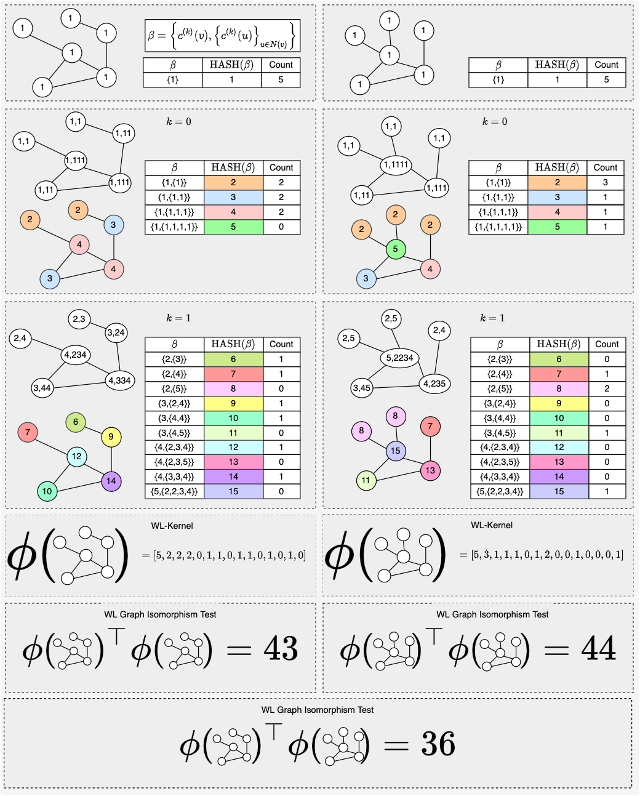

### Graph Kernels

- Graph kernels $\phi({G})$, are used to compute the similarity between two graphs.

### Weisfeiler-Lehman(WL) Kernel [^1]

[^1]: [Stanford CS224W Lecture 2.3](https://www.youtube.com/watch?v=buzsHTa4Hgs)

> **Color Refinement Algorithm**:
>
> - Given a graph $G$ with a set of nodes $V$
>     - Assign an initial color $c^{(0)}(v)$ to each node $v$
>     - Iteratively refine node colors by
>       - $C^{(k+1)}(v)=\operatorname{HASH}\left(\left\{c^{(k)}(v),\left\{c^{(k)}(u)\right\}_{u \in N(v)}\right\}\right)$
>
> - $\operatorname{HASH}$ maps different inputs to different **colors**

After $K$ steps of color refinement, $c^{K}(v)$ summarizes the structure of the $K$-hope neighborhood.

The WL kernel $\phi$ counts the number of nodes of a given color. The kernel reperesents a graph with a bag of colors. In more detail the kernel uses a generalized version of "bag of node degrees" since the node degrees are one-hop neighborhood information.

The WL kernel provides a strong benchmark for the development of GNNs since it is both computationally efficient and expressive. The cost to compute the WL kernel is is linear in the size of the graph.

### WL Graph Isomorphism Test

<!-- CHECK -->
The WL Graph Isomorphism Test (WL test) only guarantees that two graphs are isomorophic if $\phi{(G)}^{\top}\phi{(G)} = \phi{(G)}^{\top}\phi{(G^{\prime})}$, after color refinement is taken to completion where colors do not update in subsequent rounds. In general the WL test gives a measure of similarity or closness to isomorphism between two graphs.

### WL Test Toy Example

As we can see in the example differenct colors capture different $k$-hop neighborhood structure. The WL isomorphism test (WL test) computes the inner products between graph kernels as a measure of similarity. In this case $\phi({G})^{\top}\phi({G^{\prime}})=36$. We know from $\phi({G})^{\top}\phi({G})$ and $\phi({G^{\prime}})^{\top}\phi({G^{\prime}})$, that the two graphs are not isomorphic.

